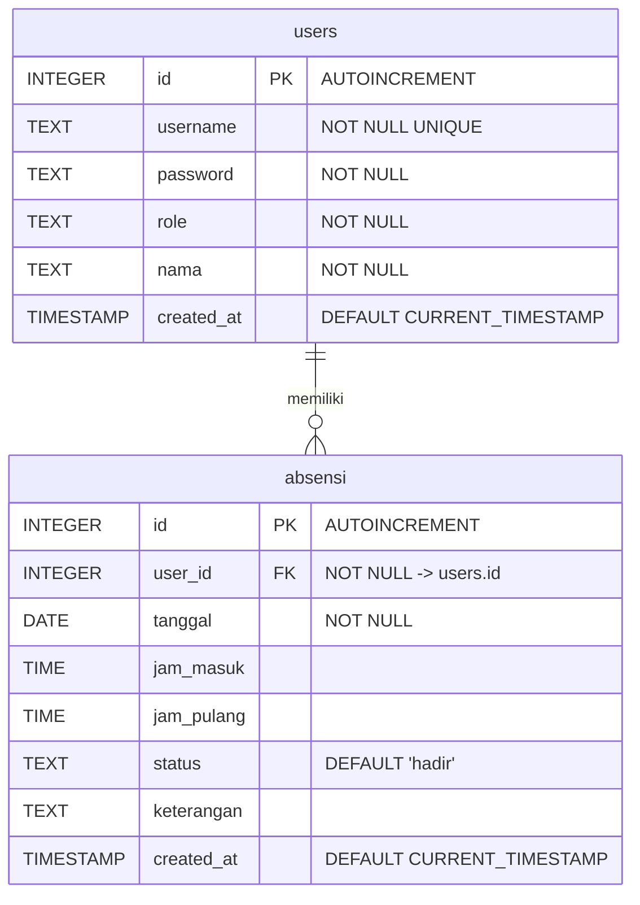

# Dokumentasi Database Absensi

## ERD



## Relasi Tabel

| Tabel | Primary Key | Foreign Key | Referensi | Relasi |
|-------|-------------|-------------|-----------|--------|
| `users` | `id` | - | - | Induk |
| `absensi` | `id` | `user_id` | `users(id)` | Many-to-One (N:1) |

### Detail Relasi

- **users → absensi**: Satu user dapat memiliki banyak record absensi.
- **absensi → users**: Setiap record absensi dimiliki oleh tepat satu user.
- Constraint: `FOREIGN KEY (user_id) REFERENCES users(id) ON DELETE NO ACTION ON UPDATE NO ACTION`

---

## Data Dictionary

### Table: `users`

Menyimpan data pengguna sistem (dosen dan mahasiswa).

| No | Kolom | Tipe Data | Constraint | Keterangan |
|----|-------|-----------|------------|------------|
| 1 | `id` | INTEGER | `PRIMARY KEY AUTOINCREMENT` | ID unik pengguna |
| 2 | `username` | TEXT | `NOT NULL UNIQUE` | Username untuk login |
| 3 | `password` | TEXT | `NOT NULL` | Password login (plain text) |
| 4 | `role` | TEXT | `NOT NULL` | Peran: `'dosen'` atau `'mahasiswa'` |
| 5 | `nama` | TEXT | `NOT NULL` | Nama lengkap pengguna |
| 6 | `created_at` | TIMESTAMP | `DEFAULT CURRENT_TIMESTAMP` | Waktu pembuatan akun |

### Table: `absensi`

Menyebut data absensi/kehadiran mahasiswa.

| No | Kolom | Tipe Data | Constraint | Keterangan |
|----|-------|-----------|------------|------------|
| 1 | `id` | INTEGER | `PRIMARY KEY AUTOINCREMENT` | ID unik absensi |
| 2 | `user_id` | INTEGER | `NOT NULL FK -> users(id)` | ID pengguna (mahasiswa) |
| 3 | `tanggal` | DATE | `NOT NULL` | Tanggal absensi |
| 4 | `jam_masuk` | TIME | - | Jam datang/masuk |
| 5 | `jam_pulang` | TIME | - | Jam pulang |
| 6 | `status` | TEXT | `DEFAULT 'hadir'` | Status kehadiran: `'hadir'`, `'izin'`, `'sakit'`, `'alpha'`, dll. |
| 7 | `keterangan` | TEXT | - | Keterangan tambahan (jika izin/sakit) |
| 8 | `created_at` | TIMESTAMP | `DEFAULT CURRENT_TIMESTAMP` | Waktu input absensi |

---

## Query Utama Sistem

### 1. Login User
```sql
SELECT id, username, role, nama FROM users WHERE username = ? AND password = ?;
```

### 2. Dashboard – Dosen: Lihat Mahasiswa
```sql
SELECT id, username, nama FROM users WHERE role = 'mahasiswa' ORDER BY nama ASC;
```

### 3. Dashboard – Dosen: Rekap Absensi per Mahasiswa (per tanggal)
```sql
SELECT u.id, u.nama, a.tanggal, a.jam_masuk, a.jam_pulang, a.status, a.keterangan
FROM users u
LEFT JOIN absensi a ON u.id = a.user_id
WHERE u.role = 'mahasiswa'
ORDER BY u.nama ASC, a.tanggal DESC;
```

### 4. Dashboard – Dosen: Rekap Absensi per Tanggal Tertentu
```sql
SELECT u.id, u.nama, a.jam_masuk, a.jam_pulang, a.status, a.keterangan
FROM users u
LEFT JOIN absensi a ON u.id = a.user_id AND a.tanggal = ?
WHERE u.role = 'mahasiswa'
ORDER BY u.nama ASC;
```

### 5. Dashboard – Mahasiswa: Riwayat Absensi Sendiri
```sql
SELECT id, tanggal, jam_masuk, jam_pulang, status, keterangan
FROM absensi
WHERE user_id = ?
ORDER BY tanggal DESC;
```

### 6. Dashboard – Mahasiswa: Absensi Hari Ini (Cek sudah absen)
```sql
SELECT id, jam_masuk, jam_pulang, status FROM absensi
WHERE user_id = ? AND tanggal = date('now');
```

### 7. Mahasiswa: Absen Masuk
```sql
INSERT INTO absensi (user_id, tanggal, jam_masuk, status)
VALUES (?, date('now'), time('now', 'localtime'), 'hadir');
```

### 8. Mahasiswa: Absen Pulang
```sql
UPDATE absensi SET jam_pulang = time('now', 'localtime')
WHERE user_id = ? AND tanggal = date('now');
```

### 9. Rekap Bulanan per Mahasiswa
```sql
SELECT strftime('%m', tanggal) AS bulan, strftime('%Y', tanggal) AS tahun,
       COUNT(*) AS total_hari,
       SUM(CASE WHEN status = 'hadir' THEN 1 ELSE 0 END) AS hadir,
       SUM(CASE WHEN status = 'izin' THEN 1 ELSE 0 END) AS izin,
       SUM(CASE WHEN status = 'sakit' THEN 1 ELSE 0 END) AS sakit,
       SUM(CASE WHEN status = 'alpha' THEN 1 ELSE 0 END) AS alpha
FROM absensi
WHERE user_id = ? AND strftime('%Y', tanggal) = ?
GROUP BY strftime('%Y-%m', tanggal)
ORDER BY tahun DESC, bulan DESC;
```

### 10. Statistik Keseluruhan (Dosen)
```sql
SELECT u.id, u.nama,
       COUNT(a.id) AS total_absen,
       SUM(CASE WHEN a.status = 'hadir' THEN 1 ELSE 0 END) AS hadir,
       SUM(CASE WHEN a.status = 'izin' THEN 1 ELSE 0 END) AS izin,
       SUM(CASE WHEN a.status = 'sakit' THEN 1 ELSE 0 END) AS sakit,
       SUM(CASE WHEN a.status = 'alpha' THEN 1 ELSE 0 END) AS alpha
FROM users u
LEFT JOIN absensi a ON u.id = a.user_id
WHERE u.role = 'mahasiswa'
GROUP BY u.id, u.nama
ORDER BY u.nama ASC;
```
